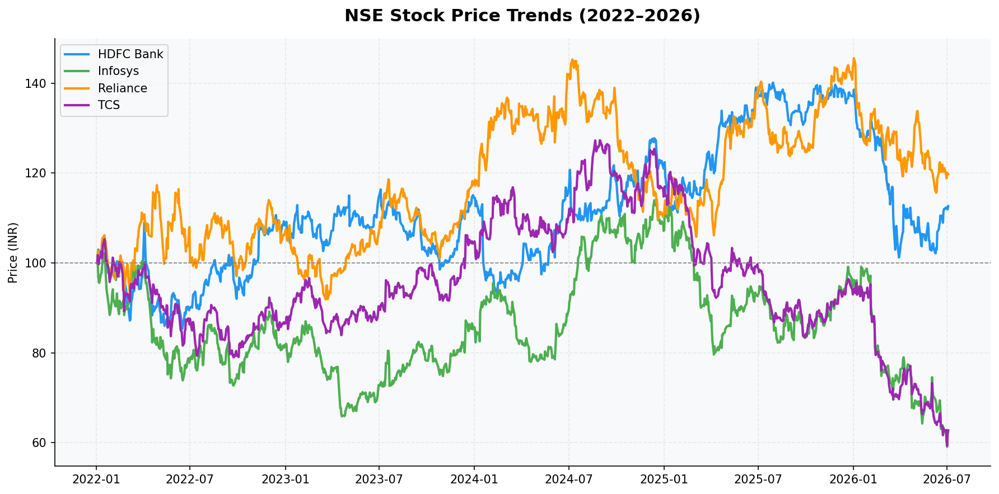
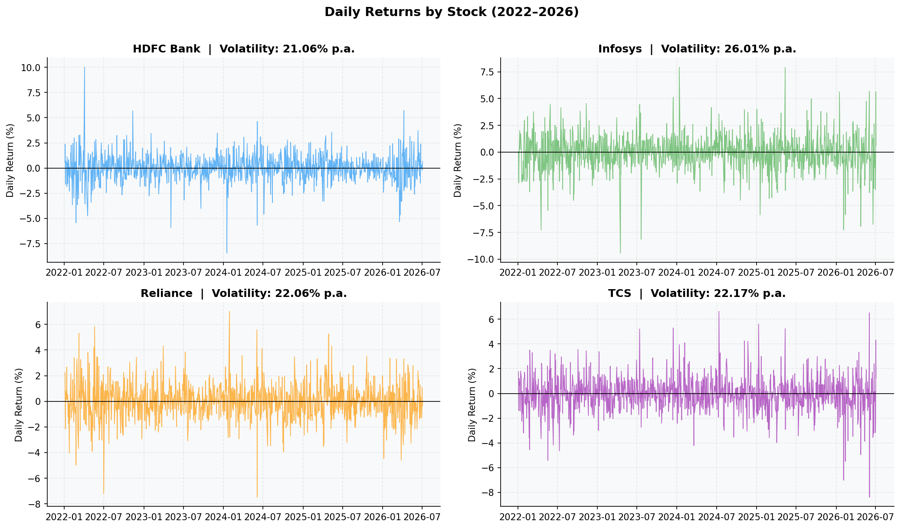
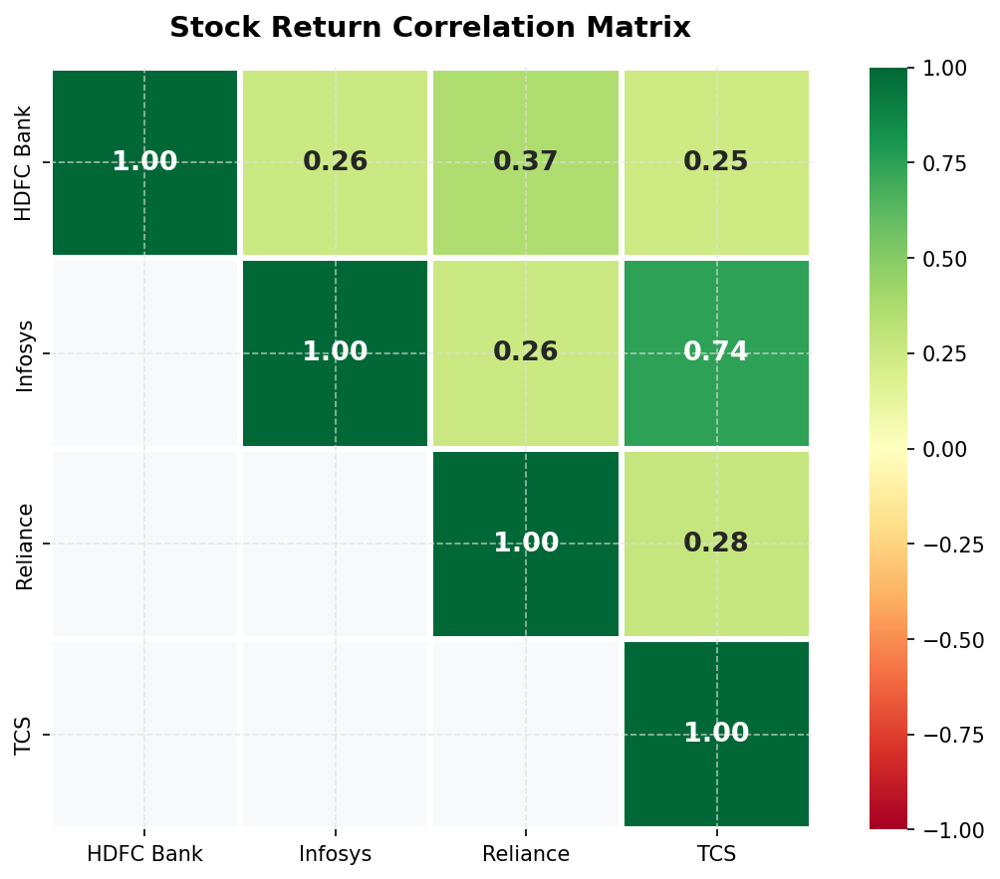
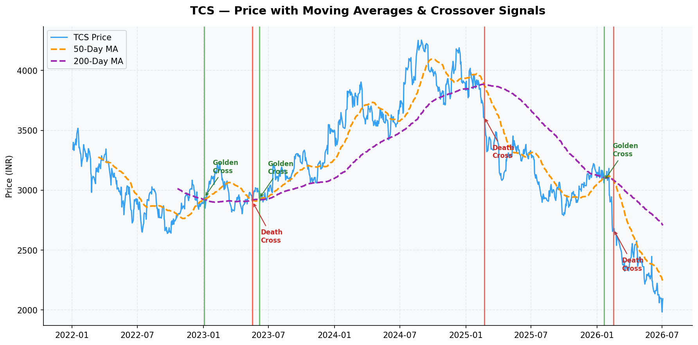
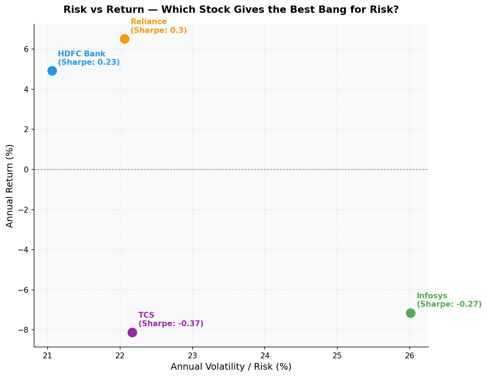

# 📈 NSE Stock Market Analysis (2022–2026)

> **Core Question:** If you had invested ₹1 lakh across these 4 NSE stocks in January 2022 — which one should you have picked, and why?
>
> **Answer: Reliance Industries** — highest total return (+21%), best Sharpe Ratio (0.30), most resilient to the global IT downturn.

---

## 📊 Executive Summary

- **Reliance** was the strongest performer, delivering ~21% total return — the only stock to consistently stay above its January 2022 entry price. Its diversified business across energy, retail, and telecom provided resilience that pure-play IT stocks lacked.
- **HDFC Bank** was the most stable stock, with the lowest annualised volatility at 21.1% and 627 bullish days (69% of the period) — ideal for risk-averse investors.
- **TCS and Infosys** move together with a correlation of 0.74 and both delivered negative returns (-8% and -7% annually), reflecting the global IT sector slowdown post-2022. Holding both provides almost no diversification benefit.
- **All 4 stocks carried near-identical risk (21–26% volatility), but wildly different returns (+7% to -8%)** — proving sector timing mattered far more than risk levels in this period.
- **Moving average signals worked best in trending markets** — the TCS Death Cross of early 2025 correctly warned of a 50%+ price decline. Two whipsaw events highlight the limitations of technical signals in choppy conditions.

---

## 🔍 Stocks Analyzed

| Stock | Ticker | Sector |
|---|---|---|
| Reliance Industries | RELIANCE.NS | Conglomerate |
| Tata Consultancy Services | TCS.NS | IT Services |
| HDFC Bank | HDFCBANK.NS | Banking |
| Infosys | INFY.NS | IT Services |

**Period:** January 2022 – June 2026 | **Data Points:** 1,108 trading days | **Source:** Yahoo Finance (via yfinance)

---

## 📉 Key Results

| Stock | Total Return | Annual Return | Volatility (p.a.) | Sharpe Ratio | Bullish Days |
|---|---|---|---|---|---|
| Reliance | +21% | +7.0% | 22.1% | **0.30** | 561 / 915 (61%) |
| HDFC Bank | +12% | +5.2% | 21.1% | 0.23 | **627 / 915 (69%)** |
| Infosys | -38% | -7.0% | 25.9% | -0.27 | 468 / 915 (51%) |
| TCS | -37% | -8.0% | 22.0% | -0.37 | 531 / 915 (58%) |

> **Sharpe Ratio** = Annual Return / Annual Volatility. Higher = better return per unit of risk. Negative = lost money while carrying risk.

---

## 📊 Analyses Performed

### 1. Price Trend Analysis
Tracked and normalized closing prices to a base of 100 for fair comparison across stocks at different price levels.



### 2. Daily Returns & Volatility
Computed daily percentage returns and annualised volatility across all 4 stocks.



### 3. Correlation Heatmap
Measured how stock returns move together — critical for portfolio diversification decisions.



### 4. Moving Average Crossovers
Applied 50-day and 200-day moving averages to TCS to detect Golden Cross (buy signal) and Death Cross (sell signal) events. Extended the analysis to all 4 stocks with a bullish/bearish day count.



### 5. Risk vs Return (Sharpe Ratio)
Plotted annualised return against annualised volatility to identify which stock gave the best return per unit of risk.



---

## 💡 Business Insights

**1. Sector matters more than company quality**
TCS and Infosys are two of India's finest companies — yet both lost over 35% of value. The global IT spending contraction post-2022 hurt both equally. Reliance's multi-sector diversification was its biggest advantage.

**2. Diversification requires low correlation**
TCS and Infosys have a 0.74 correlation — holding both is essentially a single bet on the Indian IT sector. The optimal 2-stock portfolio from this group is **Reliance + HDFC Bank** (correlation: 0.37, different sectors, both positive returns).

**3. Technical signals work best in trending markets**
The TCS Death Cross of early 2025 was highly accurate — it signalled the start of a 50%+ decline. However, two whipsaw events (mid-2023, early 2026) produced false signals in choppy markets. Moving averages are tools, not guarantees.

**4. Similar risk, drastically different outcomes**
All 4 stocks had volatility within a narrow 21–26% band. Yet returns ranged from +21% to -38%. This confirms that in this period, stock selection and sector timing — not risk management — was the primary driver of outcomes.

---

## 🛠️ Tools & Libraries

| Tool | Purpose |
|---|---|
| Python 3.x | Core programming language |
| yfinance | Fetching live NSE stock data |
| pandas | Data manipulation and analysis |
| matplotlib | Data visualisation |
| seaborn | Correlation heatmap |
| Jupyter Notebook | Interactive analysis environment |

---

## 📁 Project Structure

```
nse-stock-analysis/
│
├── analysis.ipynb          # Full analysis notebook with insights
├── stock_analysis.py       # Standalone Python script
├── README.md
│
└── visuals/
    ├── 1_price_trends.png
    ├── 2_daily_returns.png
    ├── 3_correlation_heatmap.png
    ├── 4_moving_averages.png
    └── 5_risk_return.png
```

---

## ⚙️ How to Run

```bash
# Clone the repo
git clone https://github.com/Sarthak-Agr/nse-stock-analysis.git
cd nse-stock-analysis

# Install dependencies
pip install yfinance pandas matplotlib seaborn jupyter

# Run as script
python stock_analysis.py

# Or open notebook
jupyter notebook analysis.ipynb
```

---

## 🚀 What I Would Do Next

- Add **Bollinger Bands** and **RSI** for more robust technical signals
- Build a **Markowitz Efficient Frontier** to find the mathematically optimal portfolio allocation
- Include **earnings data and P/E ratios** to combine fundamental and technical analysis
- Deploy as an **interactive Streamlit dashboard** with live data

---

## ⚠️ Limitations

This analysis is based on historical price data only. It does not account for dividends, transaction costs, taxes, or macroeconomic factors such as interest rates and currency movements. Past performance does not guarantee future results.

---

## 👤 Author

**Sarthak Agrawal**
Aspiring Data Analyst | Python · SQL · Finance Domain
[GitHub](https://github.com/Sarthak-Agr) · [LinkedIn](https://www.linkedin.com/in/sarthakagarwal-/)